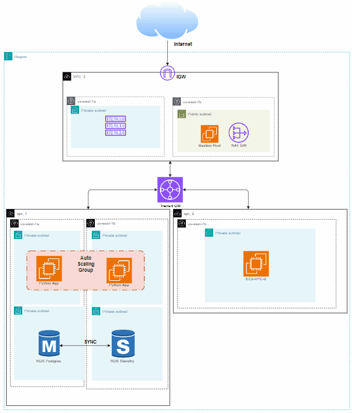

# Highly available Design deployment

# Overview

In this project well deploy High available application and databse, the main aim of this project is to build a successfull communication between The Application and The Database, and use Transit gateway to handle three VPCs traffic.

# File Structure
```bash
.
├── Highly_available_Design_deployment.pdf
├── README.md
├── app
│   ├── app.py
│   └── prerequisites.sh
├── asg.tf
├── bastionhost.tf
├── gateway.tf
├── provider.tf
├── rds.tf
├── routetable.tf
├── sg.tf
├── subnet.tf
├── terraform.tfvars
├── transitgw.tf
├── variable.tf
└── vpc.tf
```
# Architecture Diagram


# Check Blog for more Details

[Blog Link](https://devops-journey.gitbook.io/devops-journey-docs/terraform-labs/aws-highly-available-design-deployment)
